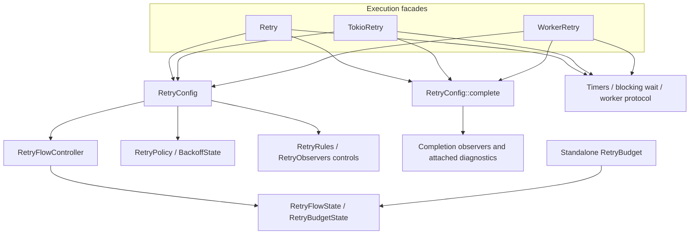

# Qubit Retry Design

[简体中文](design.zh_CN.md) · [User guide](user_guide.md) · [README](../README.md)

This document records the maintenance contract of **qubit-retry 0.23**. Public
usage belongs in the user guide; the invariants here govern internal changes.

## Scope and dependency direction

The engine separates validated policy, flow accounting, and execution mechanics.
It does not implement a worker pool, circuit breaker, alternative async runtime,
or parent/child cancellation hierarchy. SSE and custom reconnect loops may use
budget/backoff directly; they do not need a synthetic operation executor.

- `RetryPolicy` validates limits and backoff only. It is serializable with `serde`
  and can be reused across multiple `RetryConfig` values.
- `RetryConfig` binds a policy to ordered rules, observers, and fallback for one
  application error type. It holds no runtime resources; cloning shares callback
  collections through reference counting.
- `RetryConfigBuilder` forwards the full `RetryPolicyBuilder` surface so callers
  can chain `.max_attempts(...)`, `.backoff(...)`, and `.rule(...)` in one builder.
  Use `.policy(prebuilt)` only when a policy already exists (JSON, shared variable,
  or helper such as `retry_once_policy()`).
- Execution facades (`Retry`, `TokioRetry`, `WorkerRetry`) take `&RetryConfig`,
  own per-run runtime options (timer, random source, cancellation token, hard
  timeouts, worker stack size), and delegate flow decisions to the controller.
- `policy`, `backoff`, and `budget` validate values and calculate continuation
  decisions. They do not invoke application callbacks or schedule operation execution.
- `executor/internal/retry_flow_controller.rs` owns one flow's decisions and
  retained failure. State snapshots and plans separate preparation from admission.
- Async attempt/backoff outcomes and worker event/waker types stay internal.
- `RetryConfig::complete` alone dispatches completion notifications after an
  executor returns its frozen result. It is outside the controller and never
  reenters it.
- `internal/retry_panic_from_payload.rs` is the single captured-payload decoder
  used by rules, control/completion observers, workers, and reaper join failures.

Each run creates fresh accounting and backoff state. Cloning `RetryConfig`, rules,
or observers shares callback objects through reference counting without requiring
`E: Clone`. Mutable per-run state lives on the executor and is never shared by
that cloning operation.

## Admission and accounting protocol

An attempt proceeds through preparation and commitment:

1. Validate current time, check flow timeout/cancellation/soft limits, and notify
   before-attempt observers. This notification does not count an operation.
2. Refresh after normal control return and check cancellation. Prepare the
   effective absolute timeout and register its timer before admission.
3. In worker mode, spawn both worker and reaper behind a start gate. Failure of
   either spawn leaves zero additional admitted operations.
4. Recheck admission at commitment, increment attempts once, and release work.
5. On completion, commit operation time and clear active state when appropriate.
   On failure, retain the application error, timeout, or panic for later decisions.
6. Notify failure observers, select the first decisive rule, calculate backoff,
   check continuation, and notify scheduling observers only if currently eligible.
   Recheck after callbacks and actual waiting before another admission.

Only successful commitment increments `attempts`. `current_attempt` is an overlay:
it can identify the upcoming before-attempt callback before admission or retained
active worker state after grace expiry. It is not an executed-operation counter.
Inactive cancellation after controls clears the overlay but preserves committed
attempts, last failure, and selected next delay when one exists.

`operation_time_budget` sums admitted operation durations; `total_time_budget`
includes monotonic flow time, control callbacks, and backoff. They are continuation
budgets and never revoke an admitted success. Standalone `RetryBudget` binds each
linear token to one budget identity; overlap and foreign tokens are errors.
Dropping a token leaves that flow closed. Snapshot observations do not fabricate
completed operation duration for work still active.

## Control callback boundary and priorities

The four normal control-return boundaries are BeforeAttempt, AttemptFailed,
RuleDecision, and RetryScheduled. Each uses one shared refresh helper:

1. Sample the configured clock and validate/refresh accounting.
2. If validation fails, return `Infrastructure::Clock` with the last valid state.
3. If cancelled, construct a terminal using the refreshed snapshot.
4. Otherwise continue the phase's rule, timeout, or budget decision.

BeforeAttempt cancellation reports `BeforeAttempt`; the other three report
`Backoff`. A callback panic bypasses normal-return processing: `CallbackFailed`
is the primary reason and time refresh is best effort. A failed refresh cannot
replace that primary failure or manufacture elapsed time. The 0.22 ordering also
means an invalid post-rule clock precedes a normally returned Abort decision.

There is deliberately no single priority order across all phases:

| Observation point | Priority |
| --- | --- |
| Ordinary admission | Clock validity → flow timeout → cancellation → soft budget |
| Normal control callback return | Clock validity → cancellation → phase decision |
| Control callback panic | CallbackFailed; best-effort refresh only |
| Sync operation returns Ok | Valid completion accounting → success; soft limits/cancellation do not revoke it |
| Async branches ready in one poll | Operation result → cancellation → timer; a selected Err enters failure handling |
| Worker waiting for completion/exit | Cancellation → timer → collected result and confirmed join |
| Backoff cancellation and delay ready | Cancellation → delay |
| Equal effective attempt/flow deadlines | Attribute timeout to Attempt |

Sync cannot preempt its closure. Async uses biased polling and cannot preempt a
blocking poll or synchronous callback. Flow timeout caps backoff waits but does
not bound completion callbacks or worker cleanup grace.

## Clock and timer validity

Control accounting uses the monotonic clock associated with the injected timer.
Samples must preserve domain and monotonic ordering. Timer registration errors
occur before attempt commitment; active timer failures and inactive backoff timer
failures retain different context overlays. Soft elapsed budgets do not require
constructing a representable absolute deadline. Hard timeout preparation does.

Manual clocks are appropriate for deterministic operation, callback, admission,
and wait-boundary tests. Worker cleanup uses `std::time::Instant` independently
of the injected timer so a frozen manual clock cannot extend OS cleanup forever.
Time recorded after a normal callback includes that callback; completion-observer
time is excluded because the terminal snapshot is already frozen.

## Worker and reaper lifecycle

`WorkerAttemptExecutor` creates a worker plus detached reaper for each attempt.
The worker waits behind a start gate until admission succeeds. The reaper owns
the only join handle; the calling retry thread never blocks directly on join.
A shared channel carries three private `WorkerEvent` variants:

| Event | Meaning |
| --- | --- |
| Completed | Operation returned or its panic was captured; TLS destruction may still run |
| Joined | Reaper completed join, including TLS destruction; join panic can supply a failure without Completed |
| Wake | Cancellation or timer future needs another poll |

Completed and Joined can arrive in either order. Both a result and exit proof
are required for normal completion. Wakers use weak senders so they cannot hide
loss of both worker/reaper senders. A disconnected incomplete protocol becomes
an infrastructure error, never proof of successful exit.

On cancellation, timeout, or active timer failure, cancel the attempt token and
observe exit only for the configured real-time grace. Unrelated events do not
reset the deadline; a join marker alone proves exit during cleanup. An expired
grace returns `WorkerStillRunning` with Cancellation, AttemptTimeout, FlowTimeout,
or TimerFailure attribution. A channel failure remains structural failure.
The flow never starts another worker while the previous one may remain alive.
Uncooperative work or TLS destruction can leave worker and reaper threads alive;
no timeout/cancellation means the normal exit wait can remain unbounded.

## Panic isolation and completion ownership

Only worker execution captures operation panics. Sync/async operation creation
or polling panics propagate and bypass completion. Rules and control observers
capture their own panics as terminal `CallbackFailed`; later controls do not run.
Completion observers instead capture diagnostic failures, continue in registration
order, and cannot change the already frozen success or failure.

Captured payload decoding preserves static string, String, or NonString identity.
Dropping a non-string payload is guarded; if its destructor panics, NonString
remains the classification and only the secondary payload is forgotten to prevent
recursive destruction. This is not a guarantee for arbitrary result/error
value destructors, panic hooks, process abort, or TLS destructor double panic.

`RetrySuccess::into_parts` returns a triple with completion diagnostics;
`RetryError::into_parts` returns four elements: reason, last failure, context,
and completion diagnostics. No lossy failure-consumer alias exists.
`into_value_discarding_diagnostics` also discards context. `map_error` consumes
only a retained application error with an `FnOnce` mapper called zero or one times;
it preserves all other data and imposes no extra Clone/Send/static bounds.

All three public run wrappers delegate exactly once to `RetryConfig::complete`
after `run_inner` returns. A dropped async run future, outward unwind, or abort
has no completion guarantee. There is no second completion event after observer
failure.

## Backoff numerical and hint contracts

Base strategies, hint resolution, jitter, and the final delay cap are distinct.
Uniform interpolation returns exact endpoints for samples zero and one, bypassing
floating Duration round trips, and clamps intermediate results to its closed
interval. Custom random sources must supply finite in-range samples; invalid
NaN input is not a promised recovery protocol. Exponential growth saturates.

A strategy's `maximum_delay` describes only the base delay. Full/bounded jitter
and preferred/minimum hints may change the effective range. Normal hints do not
jitter the server value; jittered hints explicitly permit it. `limit_delay` is
applied last and can truncate even a minimum hint. Preserve source labels and
base/effective values in `BackoffStep`; domain adapters decide whether a truncated
server minimum is acceptable. Serde DTOs reject unknown/irrelevant fields and
keep absent numeric ratio distinct from null.

## Downstream ownership boundaries

| Consumer | Terminal conversion and diagnostics |
| --- | --- |
| rs-http | Outer domain kind/message and HTTP fields are projected by borrowing; complete RetryError is moved into source, preserving the original HttpError/backend chain and completion failures |
| rs-cas | Preserve CasRetryFailure and timeout_current projection, store completion failures out of line, expose borrowed diagnostics and lossless consuming parts |
| rs-event-bus | Preserve existing domain mapping for empty diagnostics; otherwise wrap source/context/diagnostics in terminal RetryCompletionDiagnostics with Error::source and Clone/Eq |
| rs-http SSE | Independently compose RetryBudget and BackoffState; enforce domain 1ms floor/server cap; no completion observer conversion |

HTTP method, URL, status, preview, retry_after and log_redactor are retained;
source ownership is not duplicated. EventBus's default rule aborts on the wrapper;
interceptor provenance preserves shared context identity, and reporting/dead-letter
metadata sees its stable wrapper kind plus underlying domain message. Built-in
adapter success paths register no completion observers and explicitly discard
empty diagnostics. Future observer registration requires a success diagnostic
outlet as part of the same change.

## Verification contract

Public behavior lives under root tests; only private protocol seams remain
inline. Test modules follow responsibility; comment-only mirrors add no coverage.
Use deterministic manual-clock/poll/channel regressions for ordering, payload
Drop panic, interval endpoints, diagnostics ownership, and worker exit proof.
Do not replace those with timing-sensitive sleeps or wall-clock thresholds.

CI covers default/none, serde-only, tokio-only, and all features, strict rustdoc,
doctests, benchmark compilation, and bilingual executable examples. Documentation
blocks carry explicit feature annotations and execute in temporary consumer crates
using the current path dependency. The checker preserves file/line diagnostics.
Benchmarks compare representative sync, retry, completion-observer, and worker
costs; performance is measured separately from correctness.

Coverage exemptions require concrete unreachable instrumentation evidence and
independent behavior tests. Do not change production code through coverage cfg.
Run alignment, inspect the diff, then full CI and required feature checks. Validate
HTTP, CAS, and EventBus separately, including lockfile dependency provenance.
