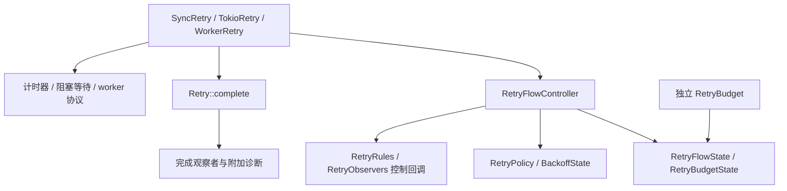

# Qubit Retry 设计文档

[English](design.md) · [用户指南](user_guide.zh_CN.md) · [README](../README.zh_CN.md)

本文记录 **qubit-retry 0.23** 的长期维护契约。公开 API 的使用方法见用户指南；内部实现变更应遵守这里的不变量。

## 范围与依赖方向

引擎分离配置验证、流程计量和执行机制。本轮不引入 worker 池、熔断器、其他异步运行时或父子取消树。
SSE 和自定义重连循环可以直接使用预算与退避，无须构造虚拟操作执行器。

- `policy`、`backoff`、`budget` 验证配置并计算是否允许继续，不调用业务回调，也不负责调度操作执行。
- `executor/internal/retry_flow_controller.rs` 负责一次流程的决策及最后失败；状态快照和计划将准备与准入提交分开。
- 执行门面负责运行闭包、轮询 future 或管理一次 OS worker 尝试。异步结果、worker 事件和 waker 类型保持私有。
- `Retry::complete` 是唯一完成通知入口，在执行器返回冻结结果后调用，不属于控制器，也不重新进入控制流程。
- `internal/retry_panic_from_payload.rs` 是已捕获载荷的唯一解码器，规则、控制/完成观察者、worker 和 reaper join 失败共同使用。

每次 run 都创建独立计量与退避状态。克隆 `Retry`、规则集合或观察者集合只共享引用计数管理的回调对象，
不要求 `E: Clone`，也不共享每次运行中的可变状态。

## 准入与计量协议

一次尝试经过准备与提交：

1. 验证当前时间，检查流程超时、取消和软预算，再通知 before-attempt 观察者；该通知不计操作次数。
2. 控制回调正常返回后刷新时间并检查取消；准备有效绝对截止时间，在准入前注册 timer。
3. worker 模式先在启动闸门后创建 worker 与 reaper，任一创建失败都不增加已准入次数。
4. 提交时重新检查准入条件，只增加一次 attempts，然后放行操作。
5. 完成后提交操作耗时，按终态清理活动状态；失败时保留业务错误、超时或 panic，供后续决策使用。
6. 通知失败观察者，选择第一个明确规则，计算退避并检查预算；仅当前允许继续时通知调度观察者。
   回调结束及实际等待后，下一次准入还要复查。

只有提交成功才增加 `attempts`。`current_attempt` 是上下文覆盖字段，可以标识尚未准入的 before-attempt 回调，
或清理宽限期结束后仍活动的 worker，不能用它代替实际操作计数。
控制回调后的非活动取消会清除该覆盖字段，保留已提交次数、最后失败，以及适用的 next delay。

`operation_time_budget` 累计已准入操作耗时，`total_time_budget` 还包含单调流程时间、控制回调与退避。
两者是续试预算，不会撤销已准入操作的成功。独立 `RetryBudget` 将线性 token 绑定到唯一预算身份，
重叠操作和外来 token 都是错误。丢弃 token 会让该流程无法继续准入；快照不会为尚活动的操作伪造已完成耗时。

## 控制回调边界与优先级

四个正常控制返回边界为 BeforeAttempt、AttemptFailed、RuleDecision、RetryScheduled，统一调用刷新 helper：

1. 从配置时钟采样，验证并刷新计量。
2. 验证失败时以最后有效状态返回 `Infrastructure::Clock`。
3. 已取消时，用刚刷新的快照构造终态。
4. 否则继续本阶段的规则、超时或预算决策。

BeforeAttempt 回调后的取消归为 `BeforeAttempt`，其余三处归为 `Backoff`。
回调 panic 不走正常返回路径：`CallbackFailed` 保持主因，只尽力刷新时间，刷新失败不能替换主因或伪造耗时。
0.22 的顺序还意味着，规则正常返回 Abort 后若时钟无效，时钟错误优先于该 Abort 决策。

不同阶段有不同优先级，不建立跨阶段的单一全序：

| 观察位置 | 优先级 |
| --- | --- |
| 常规准入 | 时钟有效性 → 流程超时 → 取消 → 软预算 |
| 控制回调正常返回 | 时钟有效性 → 取消 → 本阶段决策 |
| 控制回调 panic | CallbackFailed，时间只尽力刷新 |
| sync 操作返回 Ok | 完成计量有效后返回成功，软预算/取消不撤销成功 |
| async 同一次 poll 多分支就绪 | 操作结果 → 取消 → timer；选中的 Err 进入失败处理 |
| worker 等待操作完成和退出 | 取消 → timer → 已收集结果且确认 join |
| 退避取消与等待结束同时就绪 | 取消 → 等待结束 |
| 有效单次/流程截止时间相等 | 归因到 Attempt |

sync 无法抢占闭包。async 使用 biased 轮询，无法抢占阻塞 poll 或同步回调。
流程超时可截短退避等待，但不限制完成回调和 worker 清理宽限期。

## 时钟与 timer 有效性

控制计量使用注入 timer 所关联的单调时钟，样本必须保持相同时间域和单调顺序。
timer 注册失败发生在尝试提交前；活动 timer 失败与非活动退避 timer 失败保留不同的上下文覆盖状态。
软耗时预算不要求构造可表示的绝对截止时间，硬超时准备则有这一要求。

手动时钟适合确定性验证操作、回调、准入和等待边界。worker 清理独立使用 `std::time::Instant`，
防止手动时钟不再推进时 OS 清理宽限期无限延长。正常回调后的时间包含该回调耗时；完成观察者耗时不计入已经冻结的终态快照。

## worker 与 reaper 生命周期

`WorkerAttemptExecutor` 每次创建一个 worker 和一个分离的 reaper。worker 在准入成功前等待启动闸门。
reaper 独占 join handle，调用重试的线程不直接阻塞于 join。共享通道传递三类私有 `WorkerEvent`：

| 事件 | 含义 |
| --- | --- |
| Completed | 操作已返回或已捕获其 panic，TLS 析构可能仍在运行 |
| Joined | reaper 完成 join，包括 TLS 析构；join panic 可在没有 Completed 时提供失败 |
| Wake | 取消或 timer future 需要再次轮询 |

Completed 和 Joined 的到达顺序不固定，正常完成必须同时具备结果与退出证明。
waker 使用弱 sender，不能掩盖 worker/reaper sender 均已消失的情况。
协议未完整时通道断开是基础设施错误，不是成功退出证明。

取消、超时或活动 timer 失败后，先取消单次尝试令牌，再在真实时间宽限期内观察退出。
无关事件不能重置截止时间；清理阶段的 join 标记本身可以证明退出。
宽限期耗尽返回带 Cancellation、AttemptTimeout、FlowTimeout 或 TimerFailure 触发源的 `WorkerStillRunning`。
通道失败仍归为结构性失败。旧 worker 可能存活时，同一流程绝不创建下一次尝试。
不配合的操作或 TLS 析构可能让 worker/reaper 继续存活；未设置超时也未取消时，正常退出等待可能没有上限。

## panic 隔离与完成结果所有权

只有 worker 捕获操作 panic。sync/async 的操作创建或轮询 panic 向外传播，绕过完成通知。
规则和控制观察者捕获各自 panic，形成终止性的 `CallbackFailed`，不再执行后续控制回调。
完成观察者则捕获附加诊断，继续按注册顺序执行，不能改变已冻结的成功或失败。

解码已捕获载荷时保留静态字符串、String 或 NonString 分类。释放非字符串载荷时有保护边界：
若析构再次 panic，原分类仍为 NonString，只遗忘二次载荷，防止递归析构。
这不保证任意业务结果/错误值析构、panic hook、进程 abort 或 TLS 析构双重 panic 的安全性。

`RetrySuccess::into_parts` 返回包含完成诊断的三元组；`RetryError::into_parts`
返回原因、最后一次失败、上下文和完成诊断四个元素。不存在有损的失败消费别名。
`into_value_discarding_diagnostics` 会同时丢弃上下文。`map_error` 只消费已保留的业务错误，
`FnOnce` 映射函数调用零次或一次，其他数据全部保留，不额外要求 Clone/Send/static。

三个公开 run 在 `run_inner` 返回后恰好调用一次 `Retry::complete`。
异步 run future 被丢弃、向外展开栈或进程 abort 时不保证通知；完成观察者失败不会再触发第二次完成事件。

## 退避数值与提示契约

基础策略、提示解析、抖动与最终 cap 是不同层次。均匀插值在样本为零/一时直接返回精确端点，
避开浮点 Duration 往返，其他合法样本结果约束到闭区间内。自定义随机源必须返回有限且在范围内的值，
NaN 等非法输入不属于公共恢复协议。指数增长采用饱和处理。

`maximum_delay` 仅指基础延迟。Full/bounded 抖动及优先/最小提示可能改变有效范围。
普通 hint 不对服务端值抖动，jittered hint 明确允许。`limit_delay` 最后执行，可能截短最小提示。
`BackoffStep` 保留来源标签、基础和有效延迟；服务端最短等待能否截短由领域适配层决定。
serde DTO 拒绝未知或无关字段，并区分 ratio 缺失与 null。

## 下游所有权边界

| 消费者 | 终态转换与诊断 |
| --- | --- |
| rs-http | 借用原错误投影领域 kind/message 和 HTTP 字段，将完整 RetryError 移入 source，保留原 HttpError/后端链及完成诊断 |
| rs-cas | 保留 CasRetryFailure、timeout_current 投影，在堆上的详情对象中保存完成诊断，提供借用 getter 与无损消费拆解 |
| rs-event-bus | 空诊断保持既有映射，非空诊断以 RetryCompletionDiagnostics 包装 source/context/diagnostics，保留 Error::source、Clone/Eq |
| rs-http SSE | 独立组合 RetryBudget 和 BackoffState，执行领域 1ms 下限/服务端 cap，不转换完成观察者诊断 |

HTTP 的 method、URL、status、preview、retry_after、log_redactor 均保留，source 所有权不复制。
EventBus 默认规则对新包装返回 Abort；拦截器来源识别保留共享上下文身份，报告/死信元数据使用稳定包装 kind 和内部领域消息。
内置适配层成功路径当前不注册完成观察者，明确丢弃空诊断；未来增加注册入口必须在同次变更提供成功诊断出口。

## 验证契约

公开行为位于 root tests，仅私有协议测试保留 inline。测试模块按职责归位，纯注释镜像不代表覆盖。
优先使用手动时钟、poll 和通道构造确定性回归，验证优先级、payload Drop panic、区间端点、诊断所有权和 worker 退出证明。
不使用依赖调度运气的 sleep 或绝对耗时阈值替代正确性断言。

CI 覆盖默认/无 feature、serde-only、tokio-only、all-features、严格 rustdoc、doctest、benchmark 编译以及双语可执行示例。
文档代码块显式标注 feature，在引用当前 path 依赖的临时消费 crate 中运行，并保留原文件与行号定位。
benchmark 比较具有代表性的同步成功、重试、完成观察者和 worker 成本；性能测量独立于正确性测试。

覆盖率豁免必须有具体不可达插桩证据及独立行为测试，不通过 coverage cfg 改变生产路径。
执行 alignment 后检查 diff，再执行完整 CI 和必要 feature 检查。HTTP、CAS、EventBus 分别验收，核实锁文件依赖来源。
